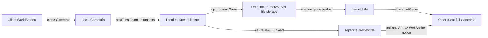

# Current multiplayer flow (verified 2026-07-18)

## Scope and evidence

This document describes the checkout on branch
`codex/feat-authoritative-multiplayer-v3` before API v3 implementation. It is
not a description of a server-authoritative system.

The relevant code paths are:

- `WorldScreen.nextTurn()` clones `GameInfo`, rebuilds transients, runs
  `GameInfo.nextTurn()` locally, and asks `Multiplayer.updateGame()` to upload
  the resulting state for online games.
- `Multiplayer.createGame()` and `Multiplayer.updateGame()` call
  `MultiplayerServer.uploadGame()`.
- `MultiplayerServer.uploadGame()` serializes the full `GameInfo` with
  `UncivFiles.gameInfoToString(... forceZip = true, updateChecksum = true)` and
  stores it by game ID, then uploads a separate preview.
- API v2 has accounts, lobby, chat, friends, game lists, and WebSocket
  concepts, but `GameApi.upload()` still sends opaque game data.
- `UncivServer` exposes file and authentication routes; it does not load a
  `GameInfo`, execute a rule, or make a revisioned game-state commit.

## Data flow and trust boundary

The red trust boundary is currently crossed at `uploadGame`: a client supplies
the complete post-mutation canonical world, including current player, turn,
map, civilizations, and game parameters. The storage server accepts it as file
contents. A checksum and preview ordering mitigate accidental corruption/races
but are neither authorization nor revision compare-and-swap.

## Mutation inventory at the boundary

| Flow | Existing mutation owner | Existing server role | V3 replacement |
| --- | --- | --- | --- |
| New online game | Client `GameStarter` | Store initial payload | Authenticated create intent; server worker runs `GameStarter` |
| Normal game action | Client domain/UI | Store replacement payload | Typed command, membership authorization, worker execution |
| End turn / AI | Client `WorldScreen` and `GameInfo.nextTurn()` | Store replacement payload | `EndTurn` command; server worker runs turn/AI |
| Resume/poll | Client downloads full save | File delivery | Authenticated current player projection + revision |
| Notification | Preview polling/API-v2 WebSocket message | Notification only | Revision notification; client must HTTP reconcile |

## Constraints discovered

`GameInfo` is the monolithic serialized world. `setTransients()` rebuilds its
ruleset-dependent graph and caches. `GameStarter` already owns creation and
`GameInfo.nextTurn()` owns turn processing, so the first implementation must
reuse these Kotlin paths under a headless execution boundary instead of porting
rules to a second implementation.

The `server` Gradle module currently depends on Ktor/JNA/Clikt and not `core`.
The `tests` module already starts a LibGDX `HeadlessApplication`, which is the
baseline for a server-safe engine harness.
